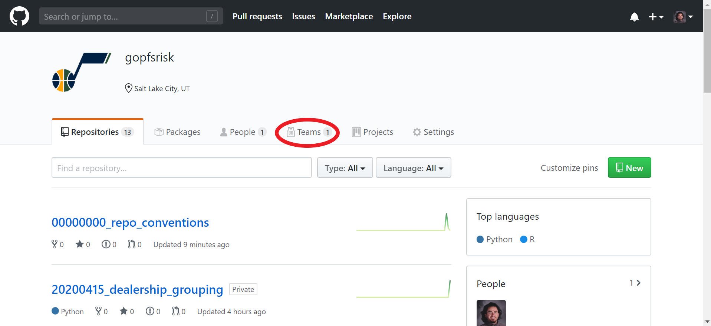
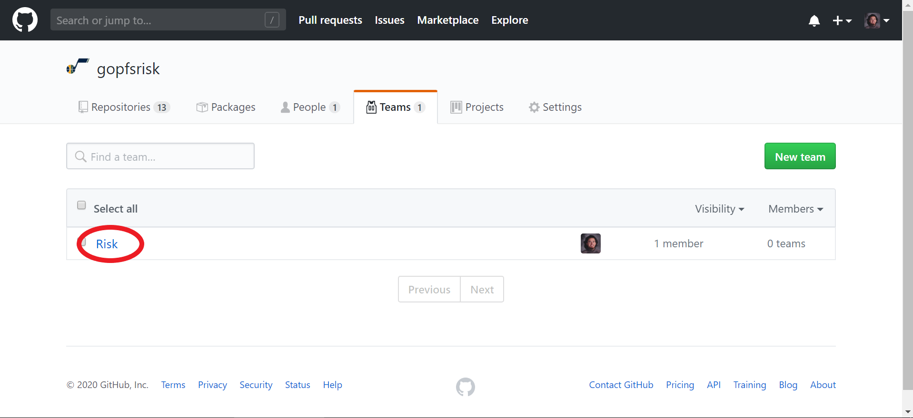
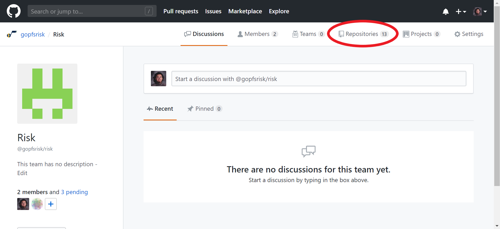
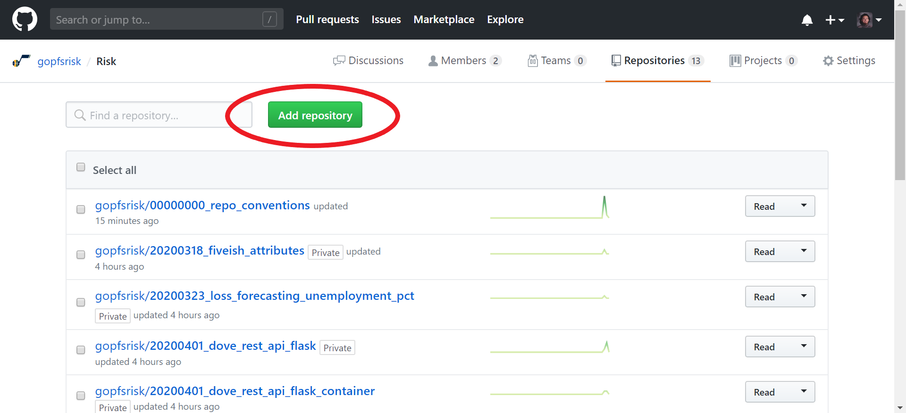
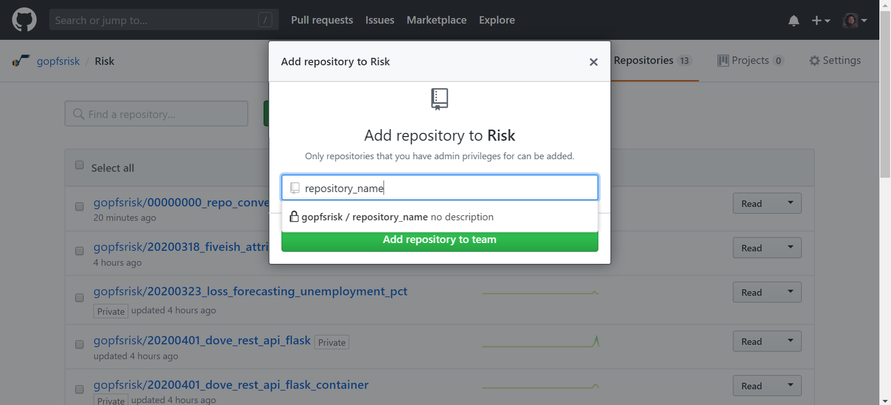
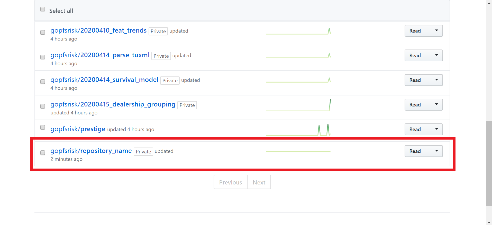

	<a href="../README.md">Home</a> | 
	<a href="what_is_git.md">What is Git?</a> |
	<a href="creating_repo.md">Creating Organization Repository</a> |
	<b><a href="add_repo_to_team.md">Add Organization Repository to a Team</a></b> |
	<a href="branching_pushing.md">Branching and Pushing Files</a>

---

## Adding an Organization Repository to a *Team*

After the repository has been created within the *gopfsrisk* organization, from within the oroganization, click *Teams*.

Click *Risk*.

Click *Repositories*.

Click *Add repository*.

Enter the repository name, select it from the dropdown, and click *Add repository to team*.

In the team's repositories, we can see the newly created repository.

---

### Now, we can use the terminal to *clone* from, *branch*, and *push* to this repository.