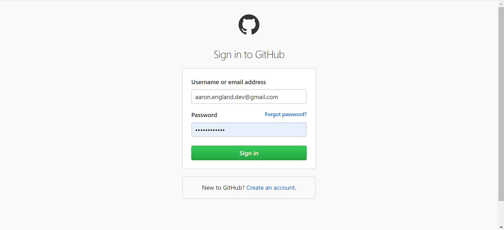
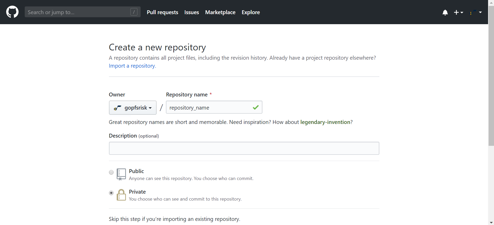

	<a href="../README.md">Home</a> | 
	<a href="what_is_git.md">What is Git?</a> |
	<b><a href="creating_repo.md">Creating Repository</a></b> |
	<a href="add_repo_to_team.md">Add Repository to a Team</a> |
	<a href="branching_pushing.md">Branching and Pushing Files</a>

---

## Creating a Repository within an Organization

### Prerequisites:
- [Install Git](https://git-scm.com/download/win)
- Create personal account
- Request access to *gopfsrisk* organization

### Navigate to the [GitHub home page](https://github.com/) and click *Sign in* to access your personal account.

### Log-in to your personal GitHub account.

### From your profile, find the *Organizations* area and click on the Utah Jazz logo to access the *gopfsrisk* organization.

### Create a new repository by clicking on the *New* button.

### Name the repository and select the *Private* radio button.

### Scroll down, check the *Initialize this repository with a README*, and click the *Create repository* button.

### For the first *Commit* (i.e., file upload), the easiset way is to drag and drop the file from *File Explorer* onto the repository.

### Scroll down and click the *Commit changes* button.

---

### Now that we have a repository in our organization, we need to [add it to a team](add_repo_to_team.md).