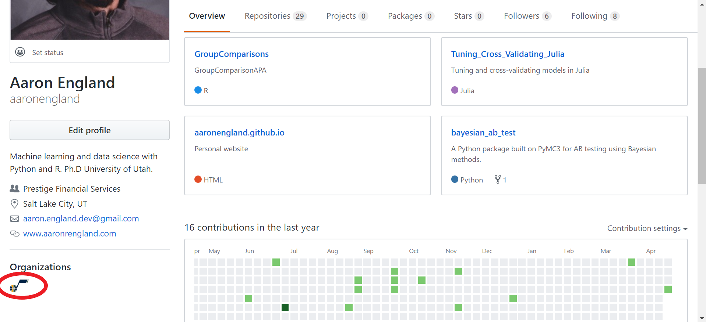
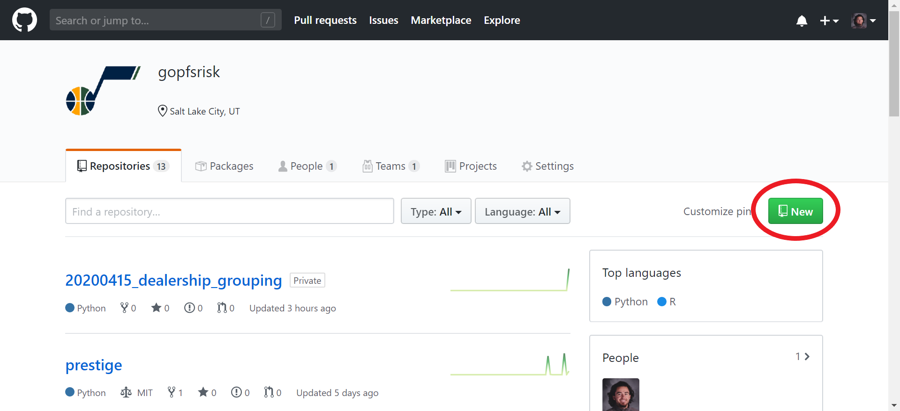
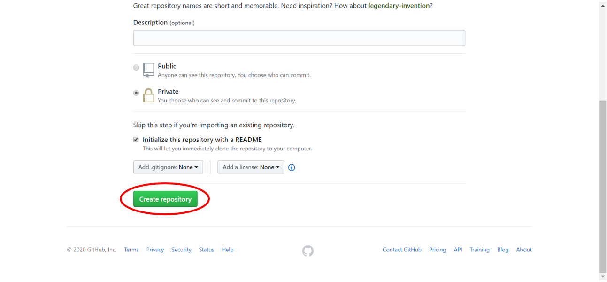
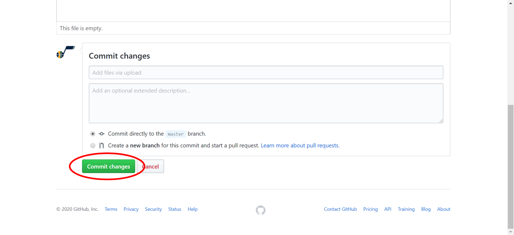
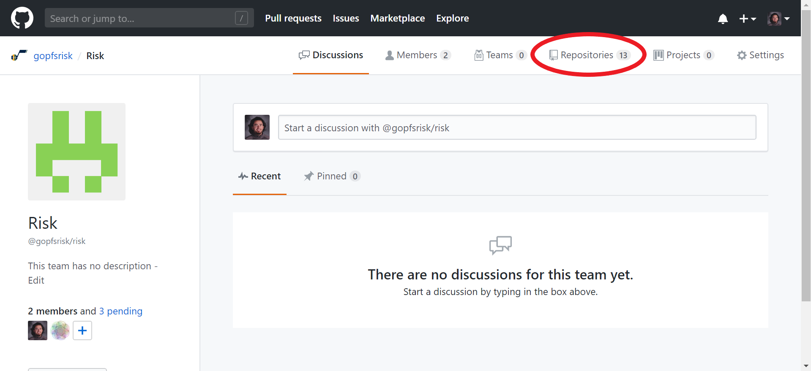
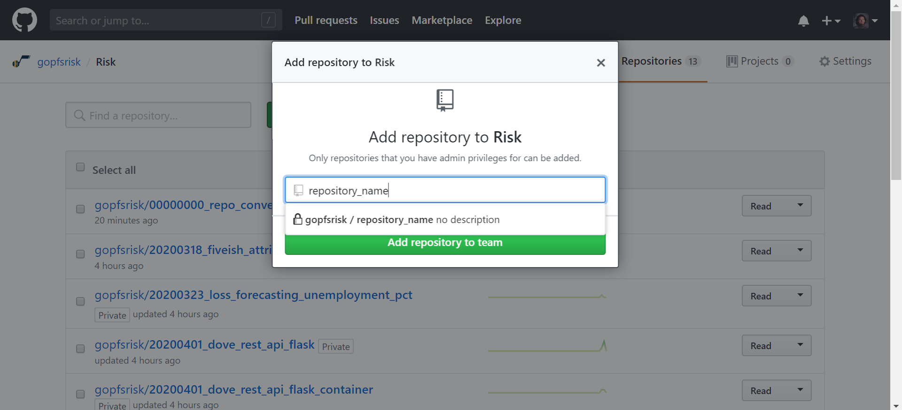
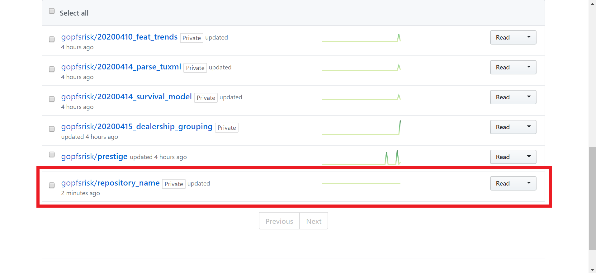

<p align="center">
	<a href="../README.md">Home</a> | <b><a href="getting_started.md">Using GitHub Teams</a></b>
</p>

---

<p align="center"></p>

#

## How to use GitHub Teams

### [What is GitHub?](https://techcrunch.com/2012/07/14/what-exactly-is-github-anyway/)

GitHub is a Git repository hosting service.

### [What is Git?](https://www.howtogeek.com/180167/htg-explains-what-is-github-and-what-do-geeks-use-it-for/)

Git is an open-source version control system started by the creator of Linux (Linus Torvalds). Version control tracks revisions and stores the modifications in a central repository. This allows easy collaboration between and among a team as well as a way to roll back changes if a new alteration results in undesirable consequences.

GitHub is perfect for data analytics and data science for the same reasons it is desirable for software developers. Additionally, GitHub allows for the storage of functions in an easily downloadable library which can be imported and used in scripts.

---

## Getting started with Teams 
### Prerequisites:
- [Install Git](https://git-scm.com/download/win)
- Create personal account
- Request access to *gopfsrisk* organization

### Navigate to the [GitHub home page](https://github.com/) and click *Sign in* to access your personal account.


### Log-in to your personal GitHub account.


### From your profile, find the *Organizations* area and click on the Utah Jazz logo to access the *gopfsrisk* organization.



### Create a new repository by clicking on the *New* button.



### Name the repository and select the *Private* radio button.


### Scroll down, check the *Initialize this repository with a README*, and click the *Create repository* button.



### For the first *Commit* (i.e., file upload), the easiset way is to drag and drop the file from *File Explorer* onto the repository.


### Scroll down and click the *Commit changes* button.



---

### Now, we can use the terminal to *clone* from, *branch*, and *push* to this repository.

---

### Working with repositories in teams:

To clone, branch, change, and push a repository in teams (from the terminal):

1. Clone a repository:
* ```git clone https://github.com/gopfsrisk/<insert_repo_name_here>``` (*Note*: do not include the "<" and ">" symbols)

*Note*: if you are getting an SSL certificate error, use:
```git -c http.SSLverify=false clone https://github.com/gopfsrisk/<insert_repository_name_here>```

2. CD into the directory named after the repository (or, open a terminal in that directory):
* ```cd <insert_repository_name_here>

3. Create a new branch:
* ```git checkout -b branch_name```

4. Confirm that the newly created branch exists:
* ```git branch```

5. Make changes locally (i.e., add code/files/etc.).

6. Add all of the changes to the branch:
* ```git add .```

7. Write a brief commit message decribing what was done:
* ```git commit -m "Insert short note here."```

8. Push the branch back to GitHub:
* ```git push --set-upstream origin branch_name```

*Note*: if upon using the ```git push --set-upstream origin branch_name``` command you are getting an SSL certificate error, use:
```git -c http.SSLverify=false push --set-upstream origin branch_name```

---

### Add repository to *team*:

After the repository has been created within the *gopfsrisk* organization, from within the oroganization, click *Teams*.


Click *Risk*.


Click *Repositories*.



Click *Add repository*.


Enter the repository name, select it from the dropdown, and click *Add repository to team*.



In the team's repositories, we can see the newly created repository.




