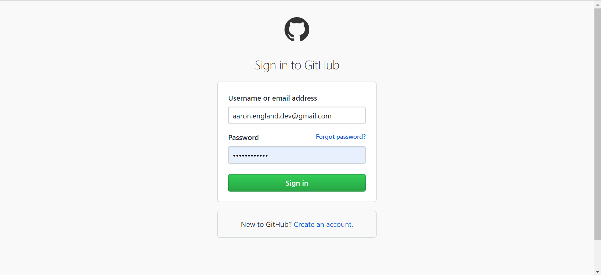
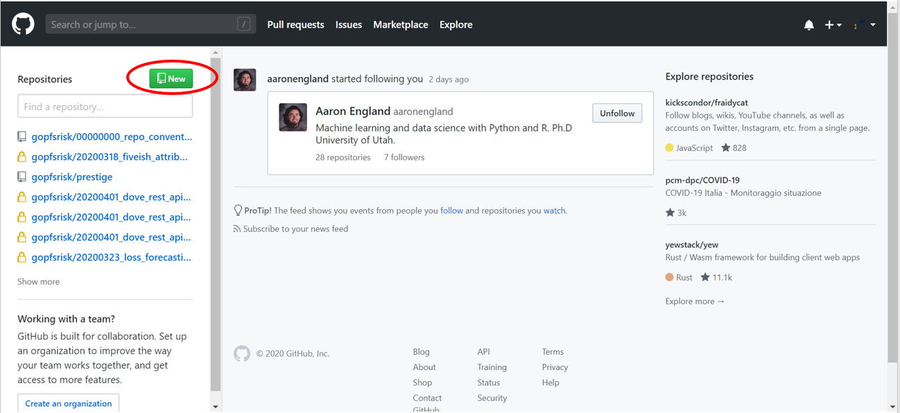
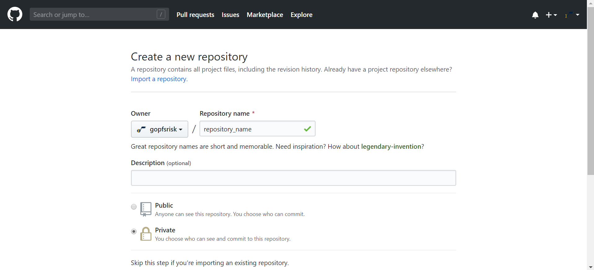
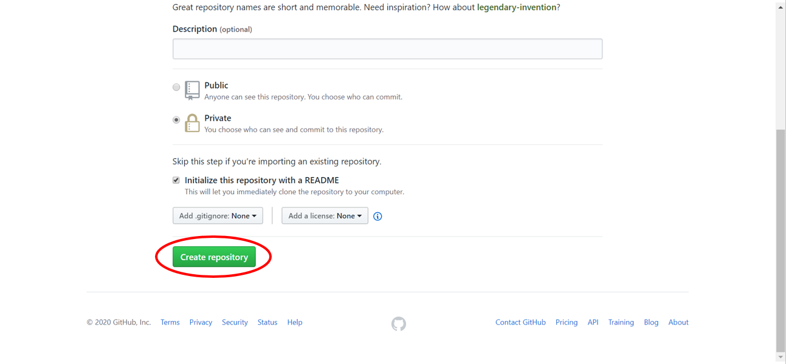

## How to use GitHub

### [What is GitHub?](https://techcrunch.com/2012/07/14/what-exactly-is-github-anyway/)

GitHub is a Git repository hosting service.

### [What is Git?](https://www.howtogeek.com/180167/htg-explains-what-is-github-and-what-do-geeks-use-it-for/)

Git is an open-source version control system started by the creator of Linux (Linus Torvalds). Version control tracks revisions and stores the modifications in a central repository. This allows easy collaboration between and among a team as well as a way to roll back changes if a new alteration results in undesirable consequences.

GitHub is perfect for data analytics and data science for the same reasons it is desirable for software developers. Additionally, GitHub allows for the storage of functions in an easily downloadable library which can be imported and used in scripts.

---

## Getting started:

### Navigate to the [GitHub home page](https://github.com/) and click *Sign in*.


### Log-in to the ```gopfsrisk``` GitHub account.



### Create a new repository by clicking on the *New* button.



### Name the repository and select the *Private* radio button.



### Scroll down, check the *Initialize this repository with a README*, and click the *Create repository* button.




